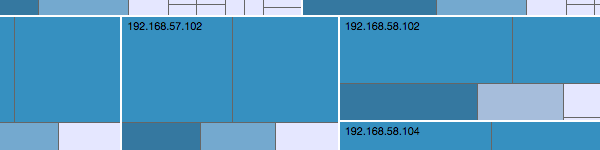
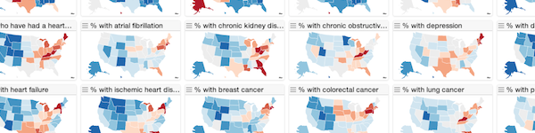
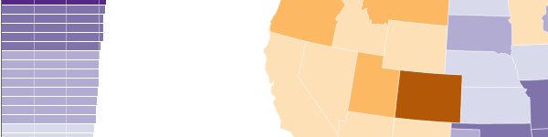

Here are some of the projects that have resulted in software that is freely available on the web or downloadable.

## NV

NV is a visualization tool for anlyzing nessus computer vulnerability data. NV was designed primarily by [Lane Harrison](http://codementum.org/). See our [VizSec 2012 paper](https://dl.acm.org/citation.cfm?doid=2379690.2379694) for more information.

## Geographic Variation in Health Indicators

This project looks at lots of health indicators simultaneously in a small multiple display to look for regional trends and outliers.

## Geographic Health Indicators

Visualization projects looking at different health indicators, derived from data pulled from the [Health Indicators Warehouse](http://healthindicators.gov/) and [geographic variation](http://www.iom.edu/Activities/HealthServices/GeographicVariation/Data-Resources.aspx) data from the Institute of Medicine. The visualizations show the geographic distribution of different health indicators - [obesity](cms-geo/obesity.html), [diabetes](cms-geo/diabetes.html), and [diabetes among medicare participants](cms-geo/diabetes-medicare.html). Except for the medicare data, you can choose a year. You can change the color legend by clicking on it.

## Cinevis

[Cinevis](https://jgoodall.me/cinevis/web/) was an experiment with [d3js](https://d3js.org/) for the [information is beautiful](http://www.informationisbeautifulawards.com) challenge. One of the awards implemented a similar idea (no longer available on the web), but was a bit slicker looking. I ran out of time...

## TNV

[tnv](http://tnv.sourceforge.net/) is intended for network traffic analysis to facilitate learning what constitutes 'normal' activity on a network, investigating packet details security events, or network troubleshooting. tnv can open saved libpcap (from tcpdump, windump, ethereal, etc.) formatted files or capture live packets on the wire, and export data in libpcap format or save the data to a MySQL database to enable examining trends over time. This was part of my disertation, and, as such, is pretty old.
